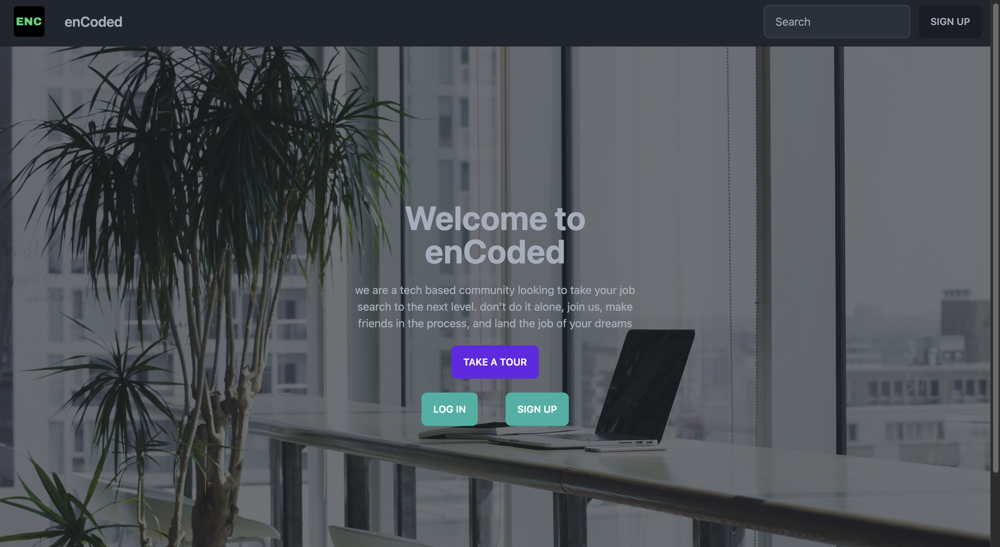
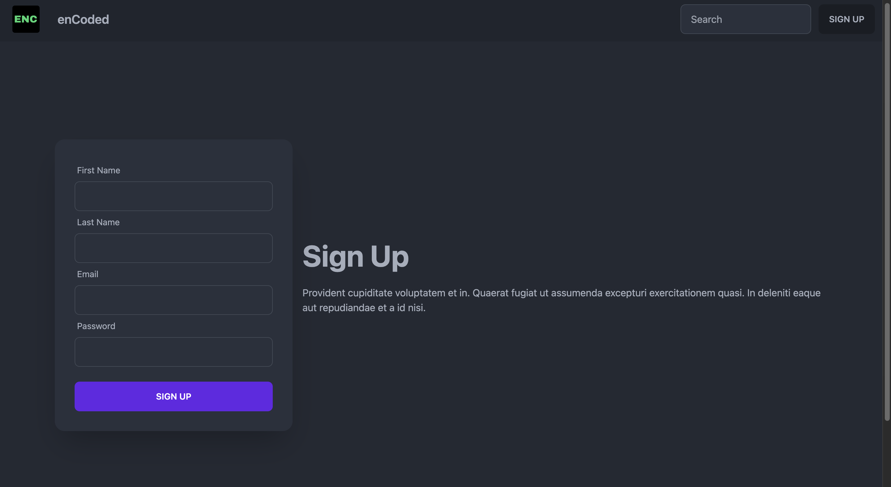
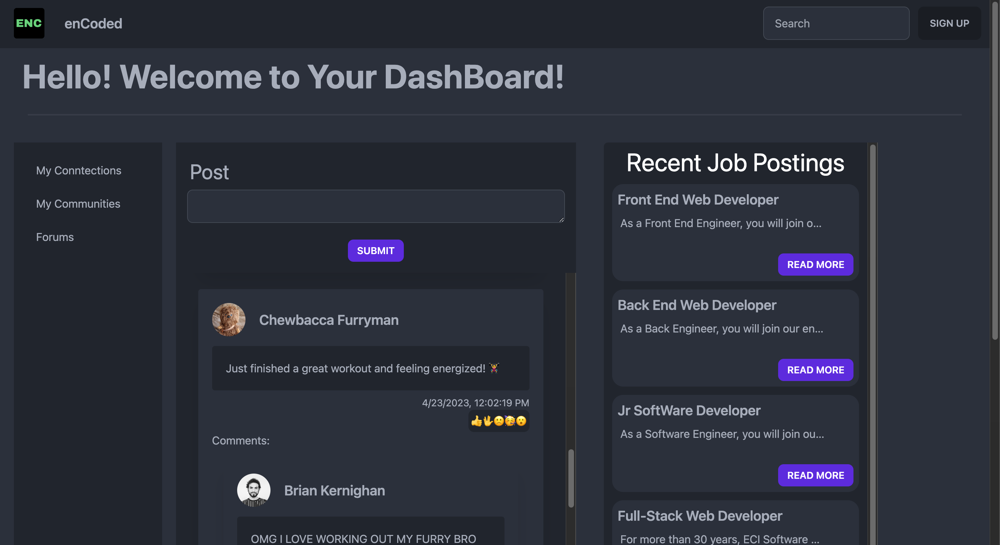
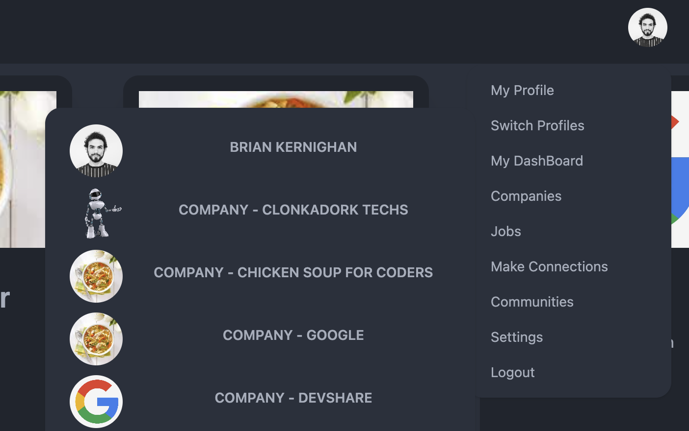
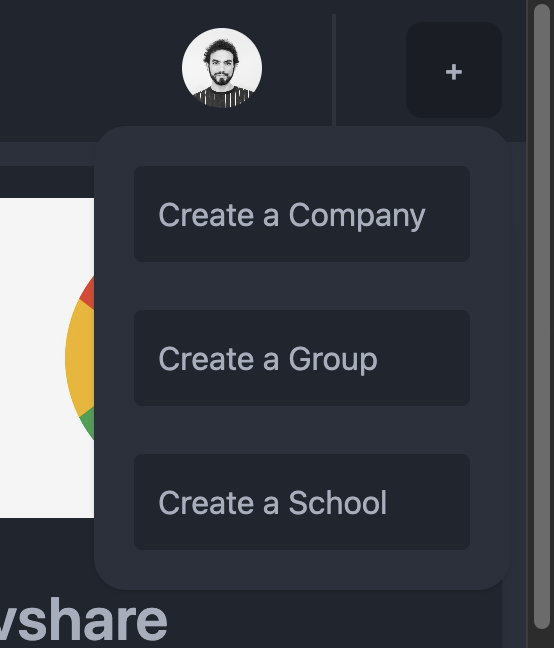
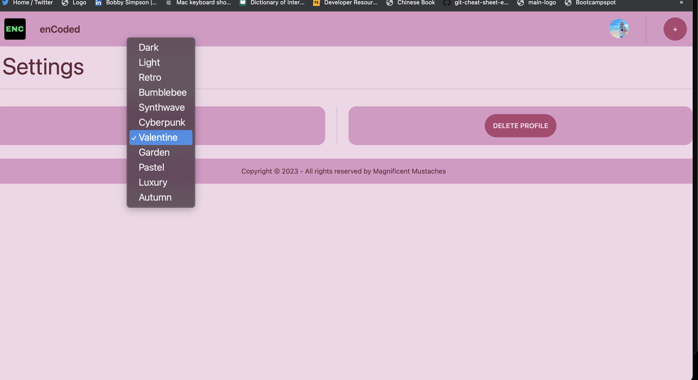

# Project 3 - magnificent-mustache-men

## Description

enCoded is a social networking platform catered specifically to the Tech Community. Unlike linkedIn, enCoded will provide only relevant information to its tech guru users. This is a platform to connect and interact with other industry professionals, companies, schools, apply for jobs. Down the road the app will included advanced search bar functionality as well as instant messaging to easily contact the user's connections on the platform. The app utilizes the apollo client library with graphql queries/mutations to interact with the Mongo database.

### App Links:

Link: https://encoded-platform.herokuapp.com/
Repo: https://github.com/therealsweven/magnificent-mustache-men/

## Installation

N/A...yet, mobile app and PWA coming soon

## Usage

Upon visiting the app, the landing page will be rendered.

Landing page:

A user may 'sign up' to create an account.

Signup:

After signing up the user will proceed to the login screen.

Login:

After logging in the user may access their dashboard where recent job postings, as well as a feed will be displayed.

Dashboard:

The user will use the navbar to navigate through the different parts of the app. My profile will take the user to their own personal profile where they can edit all their information. The 'companies' tab will render the user a list of companies that are on enCoded and links to their respective pages where the user may follow the company, view more information, and view the jobs posted currently by that company. The 'jobs' tab will render a list of job opportunities posted by companies and schools on enCoded. The 'make connections' tab will render the user a list of users that are on enCoded where they may 'conntect' with other users and view their pages. The 'communities' tab will render a list of communities on enCoded that the user may join. The 'settings' tab will take the user to their account settings, and logout will log them out.

Navbar:

The navbar also includes a '+' icon where a user may create a company page, a school page, or a community(group). The profile switcher in the above photo will allow the user to switch between their user profile and any company or school profiles that user is an admin for.

Navbar (create school, company, group):

In the settings the user may delete their account as well as switch themes. See below.

## Credits

Used royalty free photos from unsplash.com

### Collaborators

Bobby Simpson: https://github.com/therealsweven  
George Harrison: https://github.com/gharrison307 
Joshua Nelson: https://github.com/joshua-wade7  
Michael Mount: https://github.com/MMount98  
Samuel Friedman: https://github.com/reverofsuturb  

## License

MIT - Please refer to the LICENSE in the repo.
